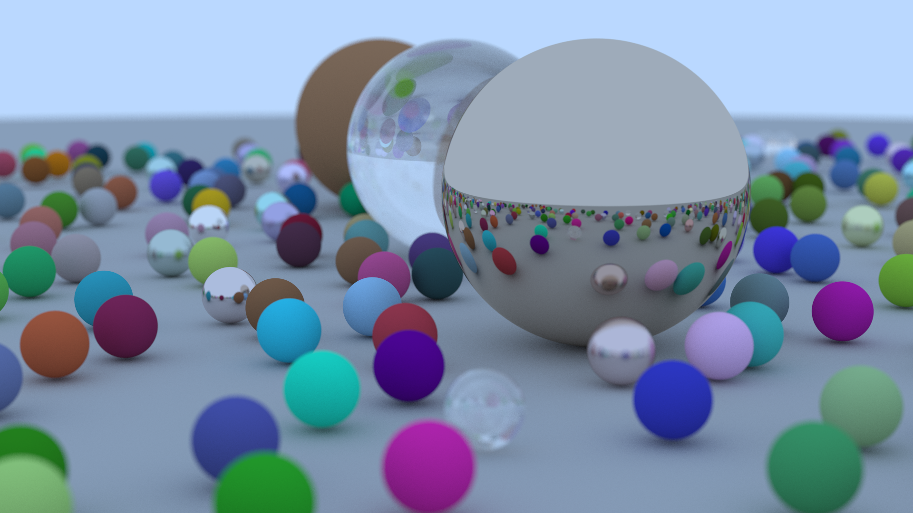

# raytracing

Raytracer written in C++, based on [Peter Shirley's books](https://raytracing.github.io)

### third party library

 - [glm](https://github.com/g-truc/glm)
 - [stb](https://github.com/nothings/stb)

### render

 - resolution: 1920x1080
 - samples: 512
 - bounces: 64
